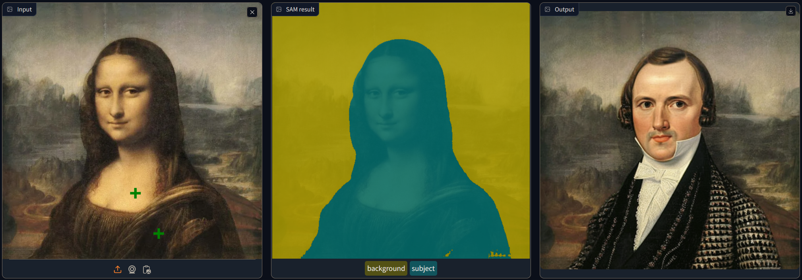
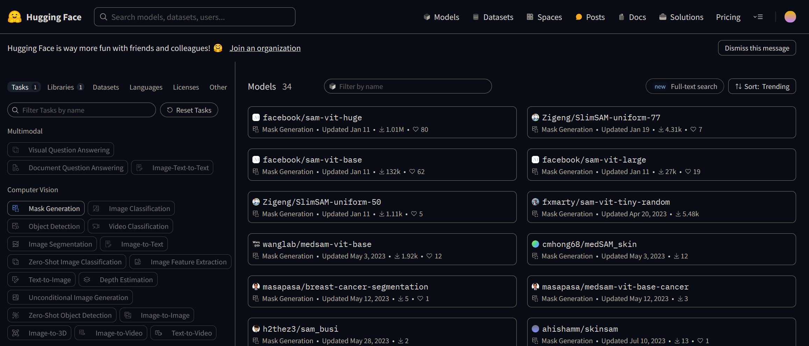
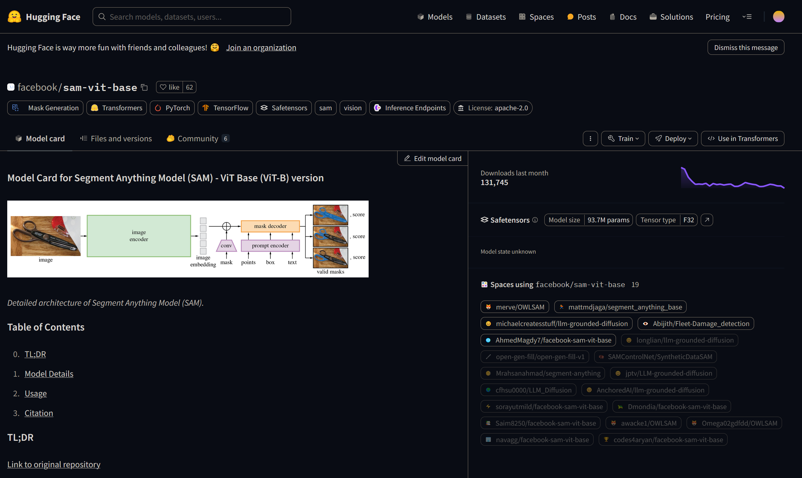
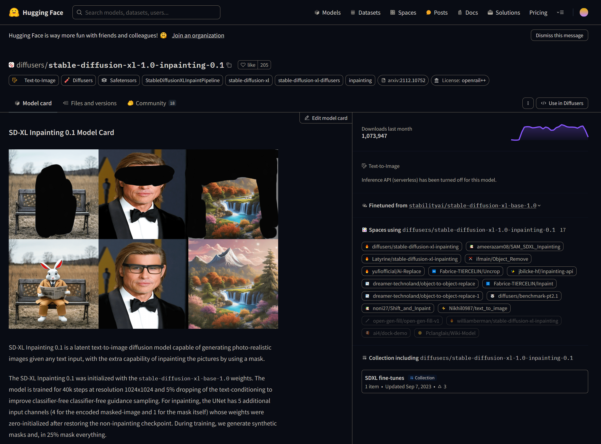

# Project: AI Photo Editing with Inpainting

## Introduction
In recent years, artificial intelligence (AI) has revolutionized the way we manipulate and enhance images, offering unprecedented possibilities for creativity and visual expression. Inpainting, a technique that involves filling in missing or damaged parts of an image, has emerged as a powerful tool in the realm of photo editing.

AI photo editing with inpainting is revolutionizing the way we enhance and restore images, offering unprecedented levels of precision and efficiency. Inpainting algorithms utilize advanced AI techniques to seamlessly fill in missing or damaged areas of an image, enabling restoration of old photographs, removal of unwanted objects, and even creative image manipulation. This technology finds widespread application in fields such as digital forensics, medical imaging, historic preservation, and creative arts, underscoring its significance in both practical and artistic domains. By automating tedious tasks and delivering remarkable results, AI photo editing with inpainting not only saves time and effort but also opens up new possibilities for visual storytelling and expression.

With inpainting, previously masked segmented subjects can be either edited:

Or the mask can inverted to edit the non-segmented parts of the image, like the background of an image:

## Project Summary
This project involves building an app that allows users to manipulate images by changing either the subject or the background. The app utilizes Generative models and Computer Vision techniques. Here's a summary of the project:

1. **Objective**: Create an app for image manipulation where users can select a subject or background and replace it with a new one (inpainting)

2. **Functionality**:
   - Users upload an image and select the main object by clicking on it.
   - The Segment Anything Model (SAM) generates a mask around the selected object.
   - Users can refine the mask if necessary.
   - Users provide a text description and possibly a negative prompt for the new background or subject.
   - An infill model creates the new background or subject based on the provided description.
   - The final image is displayed to the user.
   - Optionally, users can choose to invert the mask and substitute the subject while keeping the background.

3. **Potential Uses**:
   - Background swapping
   - Subject swapping
   - Object removal
   - Various other image manipulations

4. **Development Task**:
   - Write code to power the app's main functionality, including:
     - Calling the Segment Anything Model (SAM) and processing its output.
     - Utilizing a text-to-image diffusion model (SD-XL 1.0) to generate the new background or subject.

# Implementation
For this project, a web application has been provided to enable the swapping of backgrounds for subjects in images. The implementation involves following steps:

1. Setting up a *Segment Anything Model (SAM)*. 

    SAM is an advanced instance segmentation model developed by Meta AI, designed to perform complex image segmentation tasks. It is notable for its zero-shot inference capabilities, meaning it can accurately segment images without prior specific training on those tasks. SAM's architecture integrates three primary components: an image encoder, a prompt encoder, and a mask decoder. The image encoder processes the input image and creates a condensed feature matrix, while the prompt encoder handles various types of prompts, such as points, boxes, or text. The mask decoder then combines these features and prompts to generate segmentation masks.

   *SAM-ViT-Base* has been chosen for its superior performance in accurately segmenting images into foreground and background, its availability as a pre-trained model, and its computational efficiency, making it ideal for integrating into the app.

    The model will been downloaded from HuggingFace (https://huggingface.co/models) and serves for segmenting images into foreground and background:

    ***Settings***:
    * Tasks: `Mask Generation`
    * Libraries: `Transformers`

    
    

2. Generating segmentation masks for specified objects in images using SAM. This involves defining points on the image to indicate the subject, then using SAM to produce the segmentation mask.

3. Utilizing *Stable Diffusion XL (SD-XL) Inpainting 0.1* for inpainting. 

    SD-XL Inpainting 0.1 is a sophisticated latent text-to-image diffusion model developed to generate photo-realistic images from textual descriptions, with the added capability of inpainting—modifying specific parts of an image using a mask. This model represents an evolution of the Stable Diffusion XL 1.0 model, building upon its capabilities to produce highly detailed and realistic outputs. It is finetuned from the [stabilityai/stable-diffusion-xl-base-1.0](https://huggingface.co/stabilityai/stable-diffusion-xl-base-1.0), a large-scale multimodal model developed for generating natural language descriptions of images with the ability to incorporate structured knowledge, and trained to perform at a resolution of 1024x1024 pixels. The model incorporates a unique feature that allows for inpainting, where users can specify parts of an image to be edited or filled in with new content that aligns with a given text prompt, enhancing its versatility in image generation and editing tasks. It is designed to work by taking an input image along with a mask that indicates the area to be inpainted. Users can provide a text prompt to guide the generation of the inpainted area, allowing for precise modifications or additions to the original image.

    The SD-XL Inpainting 0.1 model will been downloaded from HuggingFace (https://huggingface.co/models) and serves for seamlessly filling in the selected regions with contextually appropriate content, thereby completing the transformation of the image according to the user's specifications.

   ***Settings***:
   * Tasks: `Text to Image`
   * Libraries: `diffusers`
   * Other: `inpainting`

   
   

   This process is guided by text prompts, to replace backgrounds. This includes loading the pretrained inpainting pipeline, specifying input parameters such as the raw image, SAM-generated mask, text prompt, and optional parameters like negative prompts and seeds for reprodicibility.

4. Creating an interactive Gradio app for users to upload images, apply SAM for segmentation, and generate new backgrounds via text prompts. This app provides a user-friendly interface for image manipulation, allowing users to experiment with different backgrounds and subjects.

   The app *app.py* aims to provide a user-friendly interface for image manipulation, enhancing engagement and experimentation with advanced AI techniques.

   The app provides 3 images with with following settings in the app:
   * Given **prompts** for infill and negative that can be customized.
   * A slider for **CFG (Classifier-Free Guidance) scale** that assesses the autonomy and self-directed decision-making capabilities of AI systems without relying on predefined categories or classifiers. Instead of comparing the inpainted results directly to ground truth images or using classifiers to assess visual quality, the CFG scale focuses on intrinsic properties of the inpainted images, such as coherence, texture consistency, and structural integrity. This approach aims to provide a more objective and comprehensive evaluation of inpainting algorithms, especially in scenarios where ground truth data or labeled datasets are scarce or unavailable.
   * **Random seed** for randomness/reproducility.

   
   
   